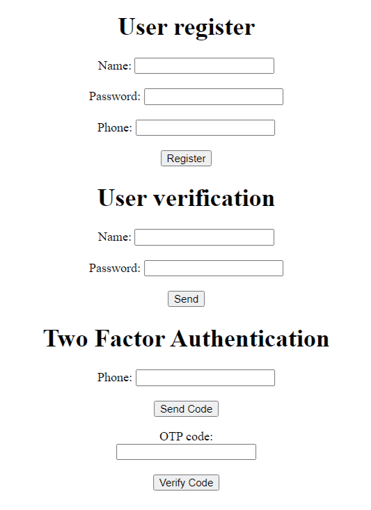

# Cybersecurity Project

# About project 

This project consists of a secure login system developed in Python. So far, the basic structure of registration and verification of name and password has been developed. The security consists of encryption through the _bcrypt_, data encryption library. In the future, together with this authentication system, a financial transaction system will be developed.
So this secure login system will involve much more than just encrypting passwords. Additional security measures will be implemented, such as protection against brute force attacks, use of HTTPS, two-factor authentication, among others related to financial transactions.

## Examples

The *create_table* function stores the information in the SQlite database.

The *create_password_hash* function takes a password as input, generates a random salt using bcrypt, and then creates the password hash using the salt. The password hash is returned as a decoded string. The *register_user* function store the user in the database.

The *verify_password* function takes a password and a password hash as input. It decodes the password hash, checks if the password matches the hash, and returns a boolean value indicating whether the password is correct or not.

In the usage example, the user enters the password, and a password hash is created using the *create_password_hash* function. Then, the program simulates a new login attempt, where the user enters the password again. The *verify_password* function is used to check if the password matches the previously created hash, and a message is displayed indicating whether the login was successful or failed.

### Interface
For now, for educational purposes, only a basic layout in html was developed.

# Technologies

- Python 3.9.11
- Librarys Python: sqlite3, bcrypt, 
- Framework Flask 2.3.2
- SQlite 3.35.5.
- DB Browser for SQLite Version 3.12.2
- IDE PyCharm 2022.3.1 (Community Edition)

# How to run the project
 
Make sure you have Python installed. 
Also, install Pipenv if you don't already have it by running the following command:

*pip install pipenv*

 

1. Clone the repository:

    *git clone: https://github.com/Micheleregina2022/cybersecurityProject.git*

2. Navigate to the project directory:

    *cd repository-name*

3. Install project dependencies using Pipenv:

    *pipenv install --dev*

4. Activate the Pipenv virtual environment:

    *pipenv shell*

5. Run the application:

    *python app.py*

# Author
Michele Regina Bora  
https://www.linkedin.com/in/michele-regina-bora/

